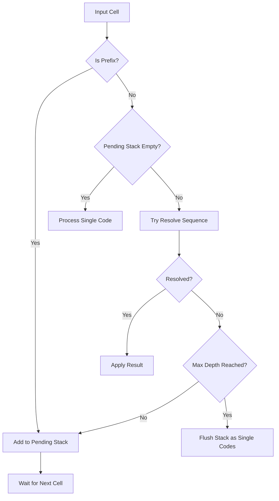
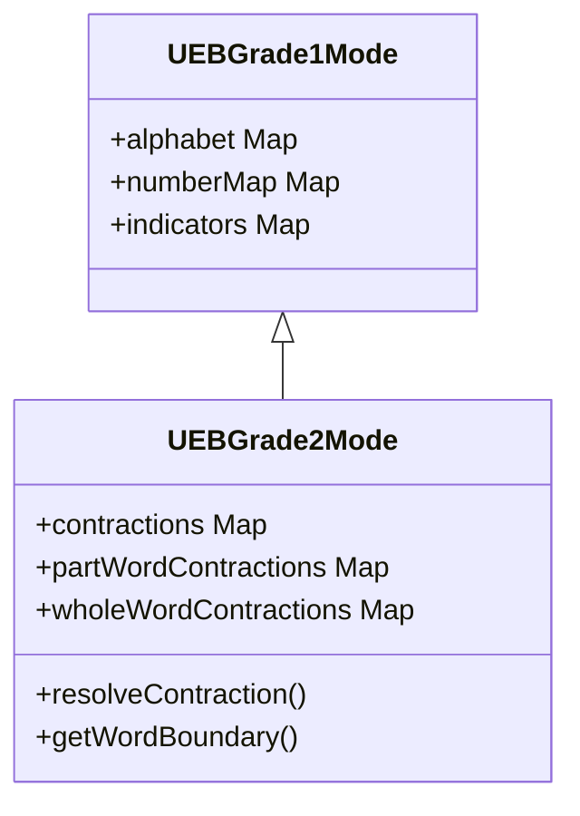
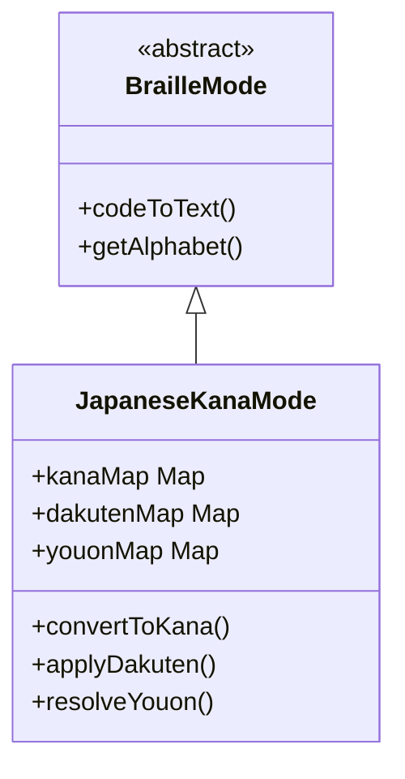
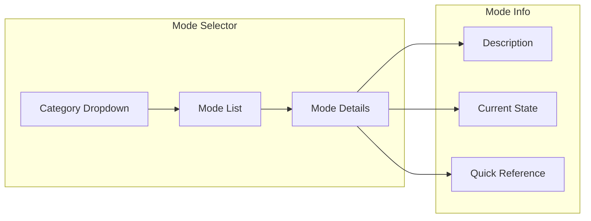

# Braille Editor Scalability Plan

## Executive Summary

This plan outlines the architectural enhancements needed to scale the braille editor to support:
1. **Multiple prefix combinations** - Enhanced multi-cell sequence handling
2. **UEB Grade 2** - Contracted braille with 200+ contractions
3. **Japanese Kana Braille** - Complete Japanese braille support
4. **Mode switching system** - Seamless transitions between braille modes

---

## Current Architecture Analysis

### Strengths
The existing codebase has a solid foundation:

```
src/
├── modes/
│   ├── BrailleMode.ts        # Abstract base class ✓
│   ├── ModeRegistry.ts       # Mode management ✓
│   └── ueb/
│       └── UEBGrade1Mode.ts  # Working implementation ✓
├── core/
│   └── EditorState.ts        # Mode-agnostic state ✓
└── types.ts                  # Shared type definitions ✓
```

- **[`BrailleMode`](src/modes/BrailleMode.ts)** base class provides clear extension points
- **[`ModeRegistry`](src/modes/ModeRegistry.ts)** supports registration, switching, and persistence
- **[`EditorState`](src/core/EditorState.ts)** delegates mode-specific logic properly
- Multi-cell sequences already partially implemented via [`getPrefixCodes()`](src/modes/BrailleMode.ts:91) and [`resolveSequence()`](src/modes/BrailleMode.ts:98)

### Gaps Identified

| Area | Current State | Required Enhancement |
|------|---------------|---------------------|
| Sequence handling | 2-cell sequences only | Support 3+ cell sequences |
| Contraction support | None | 200+ UEB Grade 2 contractions |
| State management | Basic number/capital modes | Complex contraction state, word boundaries |
| Mode categories | Flat mode list | Grouped modes by language/type |
| Japanese support | Empty directory | Complete implementation |
| UI mode switching | Basic radio buttons | Enhanced selector with categories |

---

## Architecture Design

### Phase 1: Enhanced Sequence Handling

#### 1.1 Multi-Cell Sequence System

Current [`resolveSequence()`](src/modes/BrailleMode.ts:98) handles only 2-cell sequences. Need to extend for:

- **3-cell sequences**: e.g., UEB Grade 2 `⠠⠠⠠` (capital passage)
- **Variable-length sequences**: Some contractions require look-ahead
- **Nested prefixes**: e.g., typeform + capital indicators



#### 1.2 New Type Definitions

```typescript
// Extended sequence support
interface SequenceResolver {
  minCells: number;
  maxCells: number;
  resolve: (codes: BrailleCode[], context: EditorContext) => SequenceResult | null;
}

// Enhanced ModeState for Grade 2
interface Grade2ModeState extends ModeState {
  contractionMode: boolean;
  pendingContraction: BrailleCode[] | null;
  wordBuffer: string;
  lastWordBoundary: number;
}
```

### Phase 2: UEB Grade 2 Implementation

#### 2.1 Contraction Data Structure

UEB Grade 2 has several contraction types:

| Type | Count | Examples |
|------|-------|----------|
| Whole-word | ~23 | and, for, of, the, with |
| Part-word | ~50 | ch, sh, th, ed, er, ing |
| Lower-sign | ~11 | be, con, dis, in, was |
| Initial-letter | ~10 | day, know, name, part |
| Final-letter | ~8 | -ance, -ence, -ful, -ness |

#### 2.2 Implementation Strategy



**Key Implementation Points:**

1. **Inherit from UEBGrade1Mode** - Reuse alphabet, numbers, indicators
2. **Add contraction lookup tables** - Organized by type for efficiency
3. **Word boundary detection** - Critical for contraction rules
4. **Context-aware resolution** - Same braille may mean different things

#### 2.3 Contraction Lookup Architecture

```typescript
interface ContractionEntry {
  braille: BrailleCode[];
  text: string;
  type: 'whole' | 'part' | 'lower' | 'initial' | 'final';
  rules?: ContractionRule[];
}

interface ContractionRule {
  position: 'start' | 'middle' | 'end' | 'standalone';
  before?: string;  // regex for preceding context
  after?: string;   // regex for following context
}
```

### Phase 3: Japanese Kana Braille

#### 3.1 Japanese Braille Characteristics

| Feature | Description |
|---------|-------------|
| Base characters | 46 basic kana (a, i, u, e, o + 9 rows) |
| Dakuten | 25 voiced sounds (ga, za, da, ba) |
| Handakuten | 5 p-sounds (pa, pi, pu, pe, po) |
| Youon | 33 contracted sounds (kya, shu, cho) |
| Sokuon | Double consonant marker (っ) |
| Chouon | Long vowel marker (ー) |

#### 3.2 Implementation Architecture



#### 3.3 Japanese-Specific Features

```typescript
interface JapaneseModeState extends ModeState {
  dakutenPending: boolean;
  handakutenPending: boolean;
  youonPending: boolean;
  sokuonPending: boolean;
  lastKana: string | null;
}

// Japanese-specific indicators
const JAPANESE_INDICATORS = {
  DAKUTEN: 0x04,      // dots 3
  HANDAKUTEN: 0x28,   // dots 46
  SOKUON: 0x04,       // dots 3 (context-dependent)
  CHOUON: 0x24        // dots 36
};
```

### Phase 4: Mode Switching System

#### 4.1 Mode Categories

```typescript
interface ModeCategory {
  id: string;
  name: string;
  modes: ModeInfo[];
}

const MODE_CATEGORIES: ModeCategory[] = [
  {
    id: 'ueb',
    name: 'Unified English Braille',
    modes: [
      { id: 'ueb1', name: 'UEB Grade 1', description: 'Uncontracted' },
      { id: 'ueb2', name: 'UEB Grade 2', description: 'Contracted' }
    ]
  },
  {
    id: 'japanese',
    name: 'Japanese Braille',
    modes: [
      { id: 'kana', name: 'Kana', description: 'Hiragana/Katakana' }
    ]
  },
  {
    id: 'math',
    name: 'Mathematical',
    modes: [
      { id: 'nemeth', name: 'Nemeth Code', description: 'Mathematical notation' }
    ]
  }
];
```

#### 4.2 Enhanced Mode Selector UI



#### 4.3 Mode Transition Handling

```typescript
interface ModeTransition {
  from: string;
  to: string;
  preserveContent: boolean;
  stateMapping?: (oldState: ModeState) => ModeState;
}

// Example: UEB Grade 1 → Grade 2 transition
const UEB1_TO_UEB2: ModeTransition = {
  from: 'ueb1',
  to: 'ueb2',
  preserveContent: true,
  stateMapping: (state) => ({
    ...state,
    contractionMode: true
  })
};
```

---

## Implementation Roadmap

### Phase 1: Foundation (Priority: High)

| Task | Description | Dependencies |
|------|-------------|--------------|
| 1.1 | Extend sequence handling for 3+ cells | None |
| 1.2 | Add `SequenceResolver` interface | 1.1 |
| 1.3 | Update `EditorState` for multi-cell pending | 1.1 |
| 1.4 | Add comprehensive sequence tests | 1.1-1.3 |

### Phase 2: UEB Grade 2 (Priority: High)

| Task | Description | Dependencies |
|------|-------------|--------------|
| 2.1 | Create contraction data files | None |
| 2.2 | Implement `UEBGrade2Mode` class | Phase 1 |
| 2.3 | Add word boundary detection | 2.2 |
| 2.4 | Implement context-aware resolution | 2.2, 2.3 |
| 2.5 | Add Grade 2 specific tests | 2.2-2.4 |
| 2.6 | Create Grade 2 reference UI | 2.2 |

### Phase 3: Japanese Kana (Priority: Medium)

| Task | Description | Dependencies |
|------|-------------|--------------|
| 3.1 | Create kana mapping data | None |
| 3.2 | Implement `JapaneseKanaMode` class | Phase 1 |
| 3.3 | Add dakuten/handakuten handling | 3.2 |
| 3.4 | Implement youon (contracted sounds) | 3.2 |
| 3.5 | Add Japanese-specific tests | 3.2-3.4 |
| 3.6 | Create kana reference UI | 3.2 |

### Phase 4: Mode System Enhancement (Priority: Medium)

| Task | Description | Dependencies |
|------|-------------|--------------|
| 4.1 | Add mode categories to registry | None |
| 4.2 | Implement mode transition logic | 4.1 |
| 4.3 | Create enhanced mode selector UI | 4.1 |
| 4.4 | Add mode-specific help system | 4.3 |
| 4.5 | Implement keyboard shortcuts for modes | 4.3 |

### Phase 5: Polish & Testing (Priority: Low)

| Task | Description | Dependencies |
|------|-------------|--------------|
| 5.1 | Comprehensive integration tests | Phases 1-4 |
| 5.2 | Performance optimization | 5.1 |
| 5.3 | Documentation updates | Phases 1-4 |
| 5.4 | Accessibility audit for new features | Phases 1-4 |

---

## File Structure After Implementation

```
src/
├── core/
│   ├── EditorState.ts          # Enhanced for multi-cell
│   └── SequenceResolver.ts     # NEW: Sequence resolution logic
├── modes/
│   ├── BrailleMode.ts          # Enhanced base class
│   ├── ModeRegistry.ts         # Enhanced with categories
│   ├── ueb/
│   │   ├── UEBGrade1Mode.ts    # Existing
│   │   ├── UEBGrade2Mode.ts    # NEW
│   │   └── data/
│   │       ├── contractions.ts # NEW: Contraction data
│   │       └── indicators.ts   # NEW: Extracted indicators
│   ├── japanese/
│   │   ├── JapaneseKanaMode.ts # NEW
│   │   └── data/
│   │       ├── kana.ts         # NEW: Kana mappings
│   │       └── dakuten.ts      # NEW: Dakuten rules
│   └── nemeth/                  # Future: Nemeth code
│       └── NemethMode.ts
├── ui/
│   ├── ModeSelector.ts         # NEW: Enhanced selector
│   └── ReferenceGrid.ts        # NEW: Mode-specific references
├── types.ts                    # Extended type definitions
└── main.ts                     # Updated initialization
```

---

## Technical Considerations

### Performance

- **Contraction lookup**: Use Map for O(1) lookups, organize by first cell
- **Word boundary caching**: Cache last N word boundaries for efficient backtracking
- **Lazy loading**: Load mode data on-demand to reduce initial bundle size

### Backward Compatibility

- Existing UEB Grade 1 mode remains unchanged
- New features are additive
- Mode registry falls back gracefully for unknown modes

### Testing Strategy

- Unit tests for each mode class
- Integration tests for mode switching
- Snapshot tests for contraction outputs
- Accessibility tests for new UI components

---

## Decisions (Confirmed)

| Question | Decision |
|----------|----------|
| **UEB Grade 2 Scope** | Start with subset of most common contractions (~50-70) |
| **Japanese Kana** | Support Hiragana only with conversion option |
| **Mode Switching UI** | Sidebar for mode selection |
| **Content Preservation** | Preserve content when switching modes |
| **Priority** | 1. Mode switching UI first, 2. UEB Grade 2 |

---

## Revised Implementation Order

### Sprint 1: Mode Switching Infrastructure

| Task | Description | Est. Effort |
|------|-------------|-------------|
| 1.1 | Add mode categories to [`ModeRegistry`](src/modes/ModeRegistry.ts) | Small |
| 1.2 | Create sidebar mode selector component | Medium |
| 1.3 | Implement mode transition handling | Small |
| 1.4 | Add keyboard shortcuts for mode switching | Small |
| 1.5 | Update CSS for sidebar layout | Medium |

### Sprint 2: UEB Grade 2 (Subset)

| Task | Description | Est. Effort |
|------|-------------|-------------|
| 2.1 | Create common contractions data file | Medium |
| 2.2 | Implement [`UEBGrade2Mode`](src/modes/ueb/UEBGrade2Mode.ts) class | Large |
| 2.3 | Add word boundary detection | Medium |
| 2.4 | Create Grade 2 reference grid | Medium |
| 2.5 | Integration tests | Medium |

### Sprint 3: Japanese Kana (Hiragana)

| Task | Description | Est. Effort |
|------|-------------|-------------|
| 3.1 | Create hiragana mapping data | Medium |
| 3.2 | Implement [`JapaneseKanaMode`](src/modes/japanese/JapaneseKanaMode.ts) | Large |
| 3.3 | Add dakuten/handakuten handling | Medium |
| 3.4 | Create kana reference grid | Medium |

---

## Next Steps

1. Begin Sprint 1: Mode switching infrastructure
2. Create sidebar component with mode categories
3. Register UEB Grade 1 as first mode in "English" category
4. Prepare for UEB Grade 2 addition
